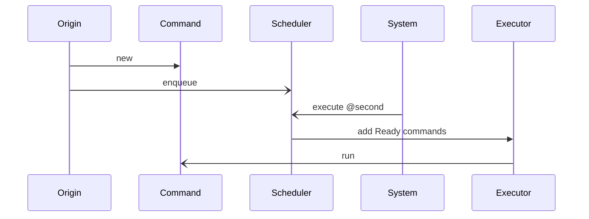
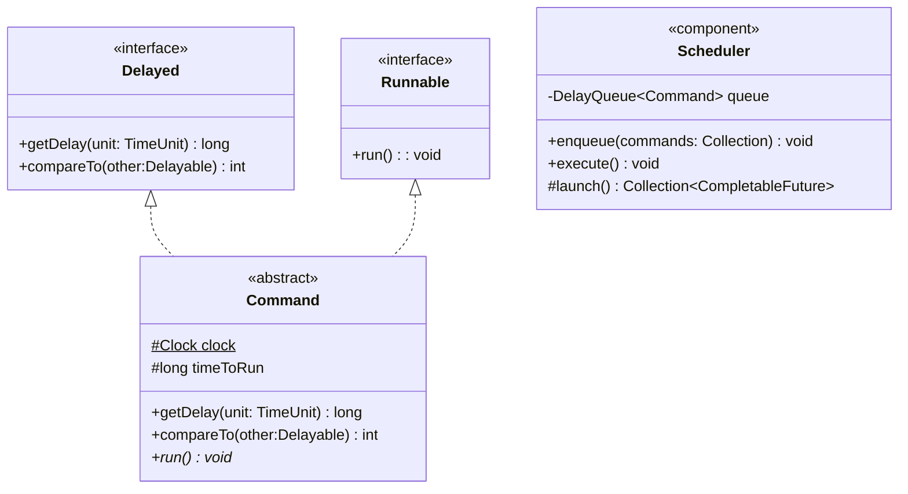

# UC-001: Run an Action after a waiting time

As a developer I need a mechanism to control actions execution to be run in a specific time in the future, independently 
of conditions of creation. Each Action carries all required information for itś execution.

## Diagrams
### Sequence

### Class diagram

## Implementation

We will implement Command class, then Scheduler; executing next steps:

- Write Unit tests for Command class; and make sure it fails with expected messages.
- 